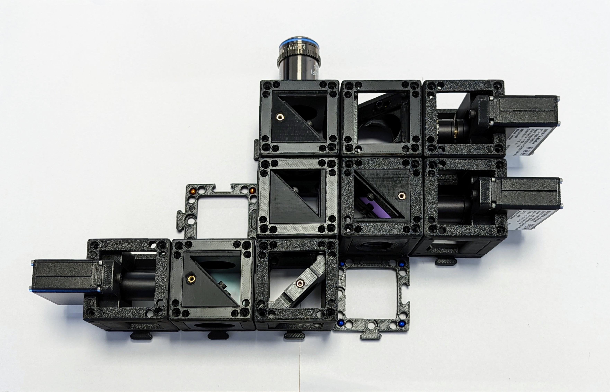

# Open Soure Hardware Optics and Mechanics Design for Fluorescence Activated (Microfluidic) Droplet Sorting (FADS) 

It in cludes the design of positioning, lasers, filters, detectors, fixtures for open droplet sorting. Note that the design in this repository is quite different to literatures designs. The set-up has been re-designed in order to make it more low-cost (estimated parts cost 20.000 USD, mainly for optical filters, detectors and laser) and open source, including hardware, software and accessible fabrication of parts where possible. Also, a number of updates and improvements have been made over the current state-of the art of droplet sorters, inspired by technical advances in the related field of flow-cytometry.

Follow us! [#twitter](https://twitter.com/WenzelLab), [#YouTube](https://www.youtube.com/@librehub), [#LinkedIn](https://www.linkedin.com/company/92802424), [#instagram](https://www.instagram.com/wenzellab/), [#Printables](https://www.printables.com/@WenzelLab), [#LIBREhub website](https://librehub.github.io), [#IIBM website](https://ingenieriabiologicaymedica.uc.cl/en/people/faculty/821-tobias-wenzel)

## Optical filters used:

| Filter | Type | supplier |
| :---   | :---  | :--- |
| FF01-561/14-25   | Bandpass filter to clean Lime-LED spectrum  | [AHF](https://ahf.de/produkte/spektralanalytik-photonik/optische-filter/einzelfilter/bandpass-filter/500-599-nm/561-14-brightline-hc/F39-563)    |
| ZET405/488/640m     | Tri-band filter to only block laser lines from camera | [Chroma](https://www.chroma.com/products/parts/zet405-488-640m)    |
| Di03-R405/488/561/635-t1-25x36   | 4-band beamsplitter to seperate scattering from fluorescence | [Laser2000](Di03-R405/488/561/635-t1-25x36)    |
| FF02-482/18-25   | Bandpass for 488nm laser scattering detection   | [AHF](https://ahf.de/produkte/spektralanalytik-photonik/optische-filter/einzelfilter/bandpass-filter/400-499-nm/482-18-brightline-hc/F39-483)    |
| glass slide     | to couple 4% reflected blue LED light into the beampath for alignment     | none    |
| FF01-446/523/600/677-25 | 4-band blocking filter for all fluorescence channels | [AHF](https://ahf.de/produkte/spektralanalytik-photonik/optische-filter/einzelfilter/bandpass-filter/multiband-filter/446-523-600-677-hc-quadband-filter/F72-866)    |
| FF555-Di03-25x36    | Central dichroic beam splitter between fluorescence channels | [AHF](https://ahf.de/produkte/spektralanalytik-photonik/optische-filter/strahlenteiler/epi-fluoreszenz-strahlenteiler/standard-strahlenteiler/langpass/strahlenteiler-hc-555/F38-555)    |
| FF495-Di03-25x36   | dichroic beam splitter to seperate blue and green fluorescence   | [AHF](https://ahf.de/produkte/spektralanalytik-photonik/optische-filter/strahlenteiler/epi-fluoreszenz-strahlenteiler/standard-strahlenteiler/langpass/strahlenteiler-hc-495/F38-495)    |
| T640LPXR   | dichroic beam splitter to seperate red and orange fluorescence      | [AHF](https://ahf.de/produkte/spektralanalytik-photonik/optische-filter/strahlenteiler/epi-fluoreszenz-strahlenteiler/standard-strahlenteiler/langpass/strahlenteiler-t-640-lpxr/F48-642)    |
| FF01-445/20-25   | bandpass filter blue    | [AHF](https://ahf.de/produkte/spektralanalytik-photonik/optische-filter/einzelfilter/bandpass-filter/400-499-nm/445-20-brightline-hc/F39-445)    |
| FF01-525/30-25   | bandpass filter green    | [AHF](https://ahf.de/produkte/spektralanalytik-photonik/optische-filter/einzelfilter/bandpass-filter/500-599-nm/525-30-brightline-hc/F37-526)    |
| FF01-600/37-25   | bandpass filter orange    | [AHF](https://ahf.de/produkte/spektralanalytik-photonik/optische-filter/einzelfilter/bandpass-filter/600-699-nm/600-37-brightline-hc/F39-637)    |
| FF01-697/58-25   | bandpass filter red     | [AHF](https://ahf.de/produkte/spektralanalytik-photonik/optische-filter/einzelfilter/bandpass-filter/600-699-nm/697-58-brightline-hc/F37-697)    |

Optical filters for SUQID fluorescene microscope:
| Filter | Type | supplier |
| :---   | :---  | :--- |
| FF458-Di02-25x36     | Beamsplitter 458 to couple in 405nm LED | [AHF](https://ahf.de/en/products/spectral-analysis-photonic/optical-filters/beamsplitters/epi-fluorescence-beamsplitters/standard-applications/longpass/beamsplitter-hc-458/F38-458)    |
| FF520-Di02-25x36   | Beamsplitter 520 to couple in 470nm LED with 635nm LED  | [AHF](https://ahf.de/en/products/spectral-analysis-photonic/optical-filters/beamsplitters/epi-fluorescence-beamsplitters/standard-applications/longpass/beamsplitter-hc-520/F38-520)    |
| ZT405/488/561/640rpcv2-UF3 | 4-band fluorescence beamsplitter       | [Chroma](https://www.chroma.com/products/parts/zt405-488-561-640rpcv2)    |
| FF01-446/523/600/677-25   | 4-band blocking filter for all fluorescence channels    | [Laser2000](https://photonics.laser2000.co.uk/products/light-delivery-and-control/microscopy-filters/filter-sets-cubes/full-multiband-sets/brightline-full-multiband-laser-filter-set-405-488-561-635-nm-laser-sources/)  |
| ZET405/488/561/640xv2 | 4-band illumination filter (20mm) | [Chroma](https://www.chroma.com/products/parts/zet405-488-561-640xv2) |
| ZT775sp-2p-UF3     | Beamsplitter brightfield to add on 785nm Raman   | [Chroma](https://www.chroma.com/products/parts/zt775sp-2p-multiphoton-shortpass-laser-dichroic)    |
| F46-950 (RT785rdc + RET785/6x + RET792LP)    | 785 nm Raman Filterset with Beamsplitter, Bandpass and Emitter      | [AHF](https://ahf.de/en/products/spectral-analysis-photonic/optical-filters/by-application/raman/raman-filter-sets/785-nm-raman-et-lp-filter-set/F46-950)    |
| T565LPXR     | (not used) Beamsplitter 565      | [AHF](https://ahf.de/en/products/spectral-analysis-photonic/optical-filters/beamsplitters/epi-fluorescence-beamsplitters/standard-applications/longpass/beamsplitter-t-565-lpxr/F48-567)    |
| ZT405/488/561/640rpcv2    | (not used) 4-band Beamsplitter = 22x27mm   | [Chroma](https://www.chroma.com/products/sets/89901v2-et-405-488-561-640nm-laser-quad-band-set)    |
| ZET405/488/561/640mv2     | (not used) 4-band emission filter 20mm   | [Chroma](https://www.chroma.com/products/sets/89901v2-et-405-488-561-640nm-laser-quad-band-set)     |

## Related documents:

* The open source FPGA controll is documented seperately: https://github.com/MakerTobey/Open_FADS_FPGA_control
* The microfluidic chip is positioned with an [open source SQUID microscopy stage](https://github.com/wenzel-lab/squid-motorized-stage).
* And the otptical detection arm assembly is based on the [Open-UC2 3d printed optics cubes](https://github.com/openUC2/UC2-GIT).
* The modified and new Open-UC2 compatible cubes can be found in the STL folder of this repository, and all modifyable design files are openly availble in the cloud [here on OnShape](https://tinyurl.com/WenzelLabUC2), where you can view, export and copy (to modify) the project designs.

A few examples of modified or new designs for this project:

## Contribute

This is an open project in the Wenzel Lab in Santiago, Chile. If you have any suggestions to improve it or add any additional functions make a pull-request or [open an issue](https://github.com/wenzel-lab/droplet-cytometry-optomechanics/issues/new).
For interactions in our team and with the community applies the [GOSH Code of Conduct](https://openhardware.science/gosh-2017/gosh-code-of-conduct/).

## License

[CERN OHL 2W](LICENSE) © Tobias Wenzel. This project is Open Source Hardware - please acknowledge us when using the hardware or sharing modifications.
